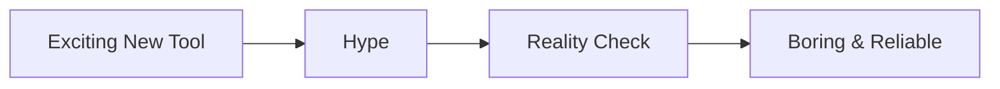

Every week there's a new JavaScript framework, a new CSS tool, a new way to build the same thing we've been building for twenty years. It's exhausting, and it's a trap.

## The Hype Cycle
```python
  def hello():
      print("Hello world!")
```

New technology promises simplicity, performance, $a=b$ and developer happiness. Early adopters love it. The community grows. Then reality hits: edge cases appear, documentation is thin, the best practices haven't been discovered yet, and your team spends weeks debugging something that would be trivial in an older tool.

## Choose Boring When It Counts

If your project has a deadline and real users, choose the technology you already understand. Experimentation is great for side projects and prototypes, but production systems benefit from battle-tested tools with known failure modes and active communities.
$$
dx=F(a)-F(b)
$$

## Boring Doesn't Mean Stagnant

You can still learn new things and try new tools. Just do it deliberately, in low-risk environments. When a new technology proves itself over months or years, it graduates from "exciting" to "boring" — and that's exactly when you should consider adopting it.

The most productive developers I know aren't the ones who chase every trend. They're the ones who pick solid foundations and build on them consistently.

<!-- cn -->

每周都有新的 JavaScript 框架、新的 CSS 工具、新的方式来构建我们二十年来一直在构建的东西。这让人筋疲力尽，而且是个陷阱。

## 炒作周期
```python
  def hello():
      print("Hello world!")
```

新技术承诺简单、性能  $a=b$  和开发者幸福感。早期采用者喜欢它。社区壮大。然后现实来了：边缘情况出现、文档薄弱、最佳实践尚未被发现，你的团队花了数周调试在旧工具中微不足道的问题。
$$
\int_{a}^{b} f(x) \, dx = F(b) - F(a)
$$



## 在关键时刻选择"无聊"

如果你的项目有截止日期和真实用户，选择你已经理解的技术。实验很适合副项目和原型，但生产系统受益于经过实战考验的工具，它们有已知的故障模式和活跃的社区。

## 无聊不代表停滞

你仍然可以学习新事物、尝试新工具。只是在低风险环境中有意地去做。当一项新技术经过数月或数年的检验，它从"令人兴奋"毕业到"无聊"——而这正是你应该考虑采用它的时候。

我认识的最有生产力的开发者不是追逐每个潮流的人。他们是选择坚实基础并持续构建的人。
